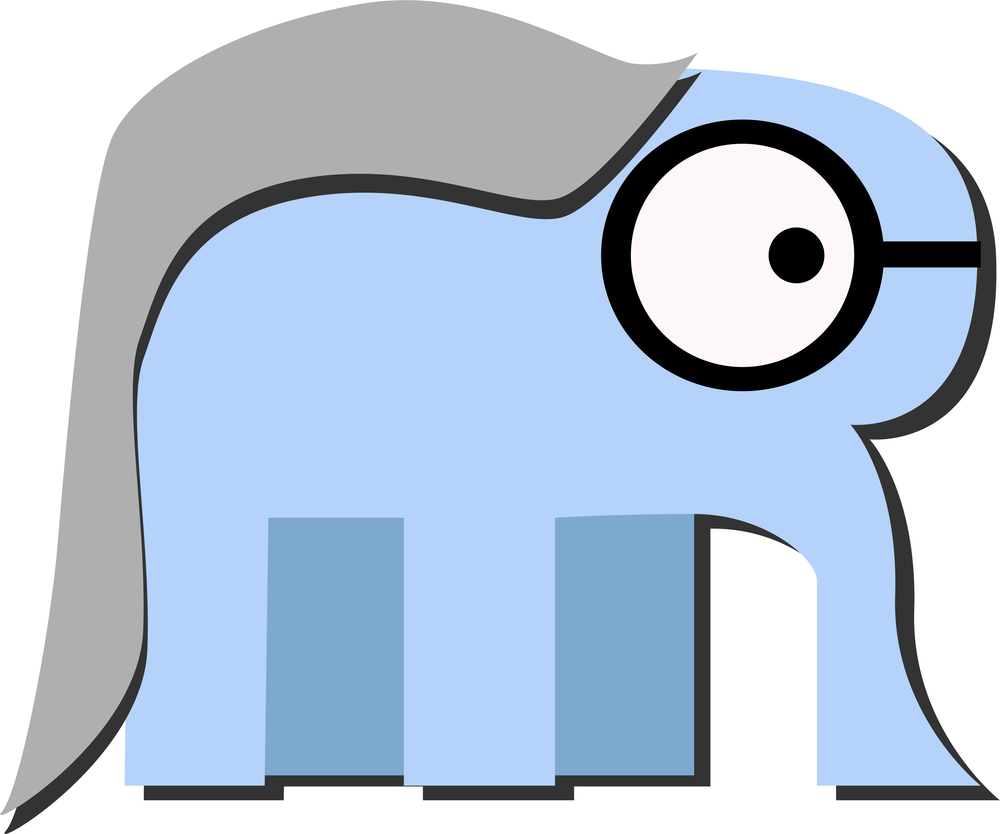
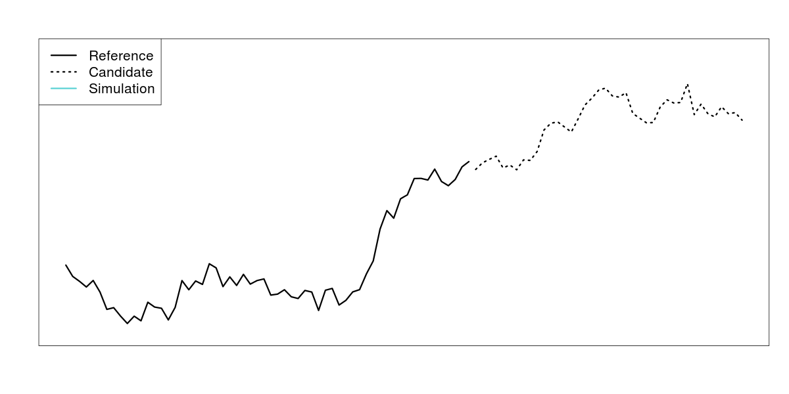
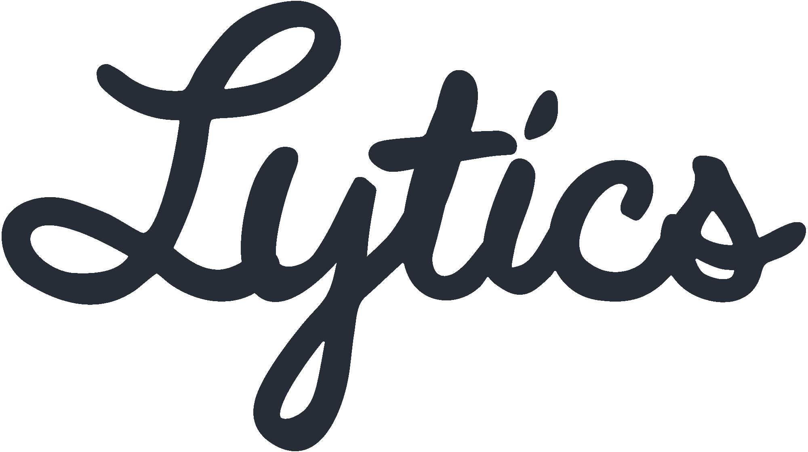

## Confessions

Who has ever made R do something it probably wasn't supposed to do?

<div style="text-align:center;">
	
</div>

--- .shout

## Why R?

<!--footer>
	<p>You can add footers here, and then mouse over them on the grid layout.</p>
</footer-->

---

## Why R?

- Plots/Visualization
- Great community support, rich library
    - Support from academia and industry
- Built for math/stats
- Dynamic, flexible (non-judgemental)
- Interactive/REPL/Exploration
- Fun!

---

## Why Not R?

- Running R in production is terrible
- Memory
- Stack Traces
- Tests/Assertions :(
- Slow (iteration, memory access)
- Poor parallelization

There are many possible workarounds: http://adv-r.had.co.nz, but you're always fighting R

--- .shout

## Why Go?

---

## Why Go?

- Great community support (Backed by Google)
- Growing libraries
    - Numeric: https://github.com/gonum (matrix/lapack/blas)
- Statically typed
- Collaborative
    - Readable, many syntactic decisions are made for you (`go fmt`)
- Stable/Maintainable
- Also fun!

---

## Why Not Go?

- Not numerically oriented
- Difficult for exploration
    - No visualization
- (Initial) Development isn't as fast as R

--- .shout

## Getting Started

<style>
.slide pre code {
	font-size: 0.8em;
	border: none;
}
</style>

---

## Hello, Go!

```go
package main

import (
	"fmt"
)

func main() {
	fmt.Println("Hello, World!")
}
```

---

## Build & Install

```bash
hello
|-- hello.go

$ cd hello
$ go build && go install  # compile, then install on $PATH
$ hello
Hello, World!

```

---

## Functions

```go
func sum(x []float64) float64 {
	var total float64
	for i := 0; i < len(x); i++ {
		total += x[i]
	}
	return total
}
```

---

## Functions

```go
func sum(x []float64) float64 {
	var total float64
	for i, value := range x {
		total += value
	}
	return total
}
```

---

## Types

```go
package vector

type Vector []float64

func (v Vector) Sum() float64 {
	var sum float64
	for _, value := range v {
		sum += value
	}
	return sum
}

```

---

## Tests

```go
package vector

import (
	"testing"
	"github.com/bmizerany/assert"
)

func TestSum(t *testing.T) {
	x := Vector{1.0, 2.0, 3.0}
	assert.Equal(t, 6.0, x.Sum())
}

```

---

## Build & Test

```bash
vector
|-- vector.go
|-- vector_test.go

$ cd vector
$ go test
PASS
ok  	github.com/drewlanenga/vector	0.004s
```

--- .shout

## Real World

---

## Problem: Detecting Changes in Marketing Segments

- Lytics is a marketing data hub, handling data aggregation and resolution from many sources
- Marketers often use segments to treat different users differently
- Marketers engage users on different channels (web, email, mobile, social, POS, etc.)
- **Question**: Does what I'm doing make any difference?

---

## Segment of Dormant Users


---

## Random Walk

- Let's consider a time series of segment sizes to be a random walk
- We want to test whether there was a change in the location of the series
    - **Hypothesis**: Is there any way to arrive where we got if there were not a location shift?
    - **Test**: Bootstrap a series of random walks to see if the resulting location is due to chance

---

## Segment of Dormant Users


---

## Segment of Dormant Users


---

## Segment of Repeat Purchasers



---

## Segment of Repeat Purchasers


--- .shout

## R Code

---

```r
walks <- function(x1, x2, niter) {
	x1.diff <- diff(x1)
	destinations <- rep(0, niter)
	for(i in 1:niter) {
		steps <- sample(x1.diff, length(x2.smooth), replace = TRUE)
		destinations[i] <- x1[length(x1)] + sum(steps)
	}
	return(list(
		lower = mean(destinations < x2[length(x2)],
		upper = mean(destinations > x2[length(x2)]
	))
}
```

--- .shout

## Go Code

---

## Channels/Concurrency

> Do not communicate by sharing memory; instead, share memory by communicating.
> - https://blog.golang.org/share-memory-by-communicating

- **Goroutines** facilitate *concurrent execution*
- **Channels** facilitate *communication across goroutines*

---

## Vector Type

```go
package walker

type Vector []float64

func (v Vector) Diff() Vector {
	y := make(Vector, len(v)-1)
	for i := 0; i < len(y); i++ {
		y[i] = v[i+1] - v[i]
	}
	return y
}
```

---

## Randomization

```go
var (
	rnd   = rand.New(rand.NewSource(time.Now().UnixNano()))
	rndmu = &sync.Mutex{}
)
```

- `rnd` is not thread safe.  If we're using `rnd` in separate goroutines, we'll need to lock it.

---

## Random Walk

```go
func walk(nsteps int, steps Vector) float64 {
	var dest float64
	for i := 0; i < nsteps; i++ {
		rndmu.Lock()
		which := rnd.Intn(len(steps))
		rndmu.Unlock()

		dest += steps[which]
	}
	return dest
}
```

---

## Bootstrapped Random Walk

```go
func Walks(niter, nsteps int, dest float64, history Vector)
  (float64, float64) {
	destinations := make(Vector, niter)
	steps := history.Diff()
	for i := 0; i < niter; i++ {
		destinations.Walk(i, nsteps, steps)
	}
	// do stuff to make comparisons to calculate
	// p-values from destinations
	return plow, phigh
}
```

---

## Bootstrapped Random Walk

```go
func (v Vector) Walk(i, nsteps int, steps Vector) {
	dest := walk(nsteps, steps)
	v[i] = dest
	// no need to return anything, updated in place
}
```

---

## Concurrent Bootstrapped Random Walk

```go
func Walks(niter, nsteps, ncpu int, dest float64, history Vector)
  (float64, float64) {
	runtime.GOMAXPROCS(ncpu)
	destinations := make(Vector, niter)
	steps := history.Diff()
	c := make(chan int, ncpu)
	for i := 0; i < niter; i++ {
		// launch each walk in its own goroutine
		go destinations.Walk(i, nsteps, steps, c)
	}
	// continued on next slide
```

---

## Concurrent Bootstrapped Random Walk

```go
	// drain the channel
	for i := 0; i < ncpu; i++ {
		<-c // wait for a task to complete
	}

	// calculate p-values
	return compare(destinations, dest)
}
```

---

## Concurrent Bootstrapped Random Walk

```go
func (v Vector) Walk(i, nsteps int, steps Vector, c chan int) {
	dest := walk[nsteps]
	v[i] = dest

	c <- 1 // send anything back to notify completion
}

```

---

```go
func compare(destinations Vector, dest float64) (float64, float64) {
	nsteps := float64(len(destinations))
	var nlow, nhigh float64
	for _, dest := range destinations {
		if dest > realDest {
			nlow += 1.0
		} else if dest < realDest {
			nhigh += 1.0
		}
	}
	return nlow / nsteps, nhigh / steps
}
```

---


## Go Resources

- Tour: http://tour.golang.org
- Installation: http://golang.org/doc/install
- Imports/Fmt: https://godoc.org/golang.org/x/tools/cmd/goimports
- Documentation:
    - Standard Library: https://golang.org/pkg
    - Community: https://godoc.org 

---

## Links

- Example Go Code: https://github.com/drewlanenga/walker
- Productionalized Example: https://github.com/lytics/impact
- R-Like Vector Package: https://github.com/drewlanenga/govector
- Talk Slides: https://drewlanenga.github.io/rmeetup
- Slide Library: http://slidify.org

---

<div style="text-align:center;">
	<div style="padding: 60px 0px;">
		 <br />
	</div>
	<div>
		Drew Lanenga <br />
		<a href="mailto:drew@lytics.io">drew@lytics.io</a>
	</div>
</div>


